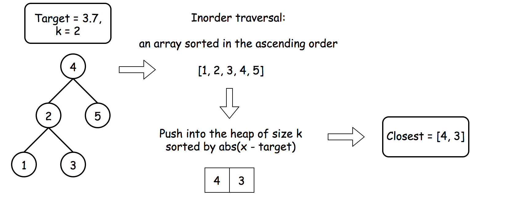
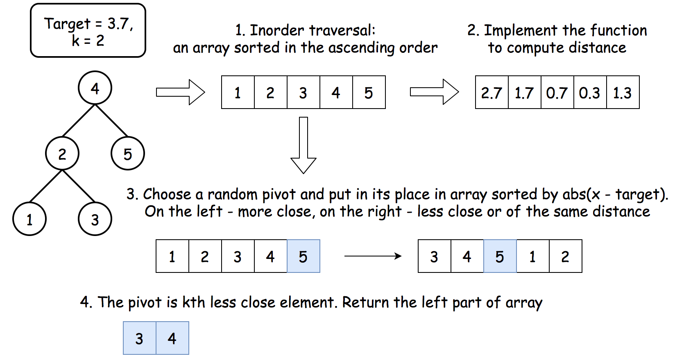

# [1] Basic Binary Search Tree Operations
```
Binary Search Tree:
for every node, 
    all nodes in its left subtree is smller
    all nodes in its right subtree is larger.
```

## 1.1 Is Binary Search Tree Or Not
[Is Binary Search Tree Or Not](./checkBST.java)
```
Determine if a given binary tree is binary search tree.
There should no be duplicate keys in binary search tree.
```
```
Assumption:
1. no duplicate keys in BST
2. integer value within 32 bit [Integer.MIN_VALUE, Integer.MAX_VALUE]
3. input: a TreeNode root
4. output: boolean
5. null root, return true.
```

```
recursion:
what I pass to my children: the value range. for left: [Integer.MIN_VALUE, me-1]
what I expect my children tell me: boolean (value within range)
what I resposne to my parent: boolean, is I and my children fit inside the range given me.

base case: current is null, return true.
```

## 1.2 Get Keys In Binary Search Tree In Given Range
[Get Keys In Binary Search Tree In Given Range](./GetRange.java)

```
Get the list of keys in a given binary search tree 
in a given range[min, max] in ascending order, 
both min and max are inclusive.

Examples

        5

      /    \

    3        8

  /   \        \

 1     4        11

get the keys in [2, 5] in ascending order, 
result is  [3, 4, 5]  --> look like an In-Order traversal.

solution:
    in-order,
    if root.key smaller than range, than we can cut the left.
    if root.key larger than range, then we can cut the right.
    
```

```
assumption\
1. input a root with range, output a List<Integer>
2. if no keys, return empty list
```

## 1.3 Search
[Search](./Search.java)
```
Find the target key K in the given binary search tree, 
return the node that contains the key if K is found, 
otherwise return null.
```
```
tail recursion 尾递归。
所以可以改写成recursion格式的。
把base case取反就是while的条件，while外面作为base case。 
```

## 1.4 Insert
[Insert](./Insert.java)
```
Insert a key into a tree (give me a root)
1. find location
2. insert
3. try recursion first, and try to update to a iteration version
```

```
output: new root node (root may change)
```

```
take away:
1. 如果发现会和parent断开连接，不妨让new created node作为返回值，这样就连接上了。
```

## 1.5 Delete
[Delete](./Delete.java)
```
core: return the updated root.
```

Algorithm

- If `key > root.val` then delete the node to delete is in the right subtree `root.right = deleteNode(root.right, key)`.
- If `key < root.val` then delete the node to delete is in the left subtree `root.left = deleteNode(root.left, key)`.
- If `key == root.val` then the node to delete is right here. Let's do it :
  - If the node is a `leaf`, the delete process is straightforward : root = null.
  - If the node is not a leaf and `has the right child`, then `cherry-pick the smallest one in right subtree`, and update root by it. `return newRoot`
  - If the node is not a leaf and `has only the left child`, then `return root.left`.
    Return root.

参考[laioffer答案](https://docs.google.com/document/d/1Qimmqsz4we-YM88nSVKazlcxomsLXXOZrNdqzigExEM/edit)
```
上述的 has the right child 的情况，实际上是可以分为下述两个情况的：
1. smallest是叶子 - 相安无事。
2. smallest（6）还有个smallest.right存在（7）
            5           target = 5.
           / \
          3    6        <-- 找到tar后，把右子树的smallest更新上去作为新root。
        / \    / \
       2  4   #   7
上述例子中，会找到右侧的smallest即6
如果使用：5变6，然后在新root的右子树中把smallest删掉，就会出问题。
删掉6会把7丢失掉。

正确的做法是，如果发现 smallest.right != null, 就把它接到smallest本来该在的位置上。
在helper function里面分两类情况后处理，就可以实现这个目的。
```

# [2] Traversal + Comparing

## 2.1 The Closest Number In Binary Search Tree
[The Closest Number In Binary Search Tree](./ClosestNumberBST.java)
```
In a binary search tree, find the node containing the closest number to the given target number.

Assumptions:

The given root is not null.
There are no duplicate keys in the binary search tree.
Examples:

    5
  /    \
2      11
     /    \
    6     14

closest number to 4 is 5
closest number to 10 is 11
closest number to 6 is 6
```

```
Hint: the in-order traversal of a BST, will get an ascending order array.
Approach 1: recursive inorder + linear search, O(n) time
Approach 2: iterative inorder, O(k) time, k-th element is the closest one.
---------
---------
tar = 4

res = 5
5-4 == 5-4, don't update res； 5>4, root = root.left, 
2-4 > 5-4, don't update res;   2<4, root = root.right, 
root == null --> return res, i.e. return 5.
---------
```

## 2.2 Find the Largest smaller element of a given target
[Largest Smaller](./LargestSmaller.java)

```
这种有target的，可能都需要一边traversal一边解决

- traversal的时候，携带一个res，在比较的时候更新它。
- 退出条件为 cur == null

这个题，如果 cur > target, 那么cur = cur.left;
反之，cur = cur.right. 并更新res （res只可能越来越大，根本不需要判断。直接更新即可）

由于是BST，所以会相当于先找到largest smaller所在的左子树，然后开始一路走最右侧路径，获得largest。
```

## 2.3 Find k nodes that close to a target

- [LeetCode题目](https://leetcode.com/problems/closest-binary-search-tree-value-ii/)
- [LeetCode Solution](https://leetcode.com/problems/closest-binary-search-tree-value-ii/solution/)
- Question:
  - give a `root`, an int `k`, a `target` value.
  - return the `k values in BST` that are closest to the `target` 
  - can return in any order
  
- Prerequisites:
  - In-Order traversal of a BST is an ascending order array
  - Closest BST value can be found during traversal
  - the kth smallest problem --> using heap to tackle, O(NlogK) or quickSelect in O(N).
```
- Solution：
  Approach 1: heap, O(Nlogk)
    - use a heap of capacity k, sorted by the distance to the target.
  Approach 2: quickselect, O(N)
    - quickselect: a typical algo to solve "find kth something"
```
[1] [Inorder + heap](./ClosestKNodes_Heap.java)
```
Approach 1 O(N logk)
- initialize the heap with "less close element first" strategy.
- use In-Order Traversal to traverse the tree
  - push all elements into heap dring the traversal (but keep the size <= k)
- As a result, the heap contains k elements that are closest to target, convert it into a list to return.
```


[2] [convert to array + quick select](./ClosestKNodes_Quickselect.java)
```
Approach 2 O(N), but O(N^2) is the worst case which is very rare and can be neglected.
- convert the BST into an ascending array
- do quick select
```

