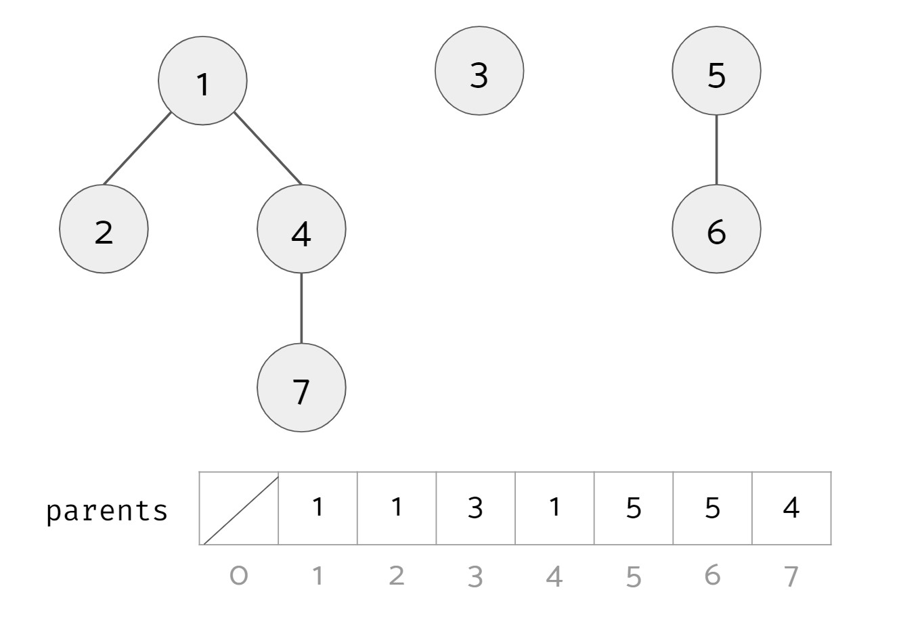

1. Find: determines in which subset a particular elements is in, and returns the representative of that particular set.
2. Union: merges two different subsets into a single subset, and return the representative of the merged subset

## *quick union*:
- the nodes in a tree --> the items in the same set
- tree --> root is the representative
- each node --> needs a reference to its parent   -->  can find root in O(height)

- `parent array: [1,1,3,1,5,5,4]`
- `element array:[1,2,3,4,5,6,7]`

### 1 Find
`find(u)` --> `the representative` of the set is the root of the tree that `u` belongs to.

### 2 Same Partition
`samePartition(u, v)` --> `true / false`

### 3 Union
`union(u, v)` --> `representative` of the merged set.
- problem: we have multiple options to do it.
- `union(4, 5)` --> we can:
    - `option1`: 1.parent = 5  (parent[1] = 5) , return 5
    - `option2`: 5.parent = 1  (parent[5] = 1) , return 1

